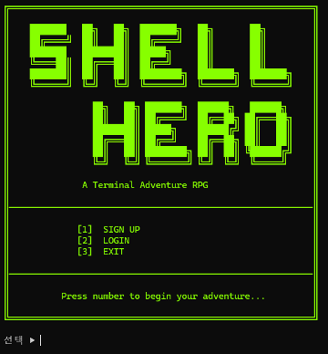

# Shell Hero

> Java 콘솔 환경에서 구현한 로그인 기반 텍스트 턴제 RPG 프로젝트

Shell Hero는 MUD와 텍스트 RPG의 구조를 참고하여 만든 Java 콘솔 RPG입니다.<br>
사용자는 회원가입과 로그인을 통해 자신의 히어로를 생성하고, 전투를 통해 보상을 얻어 스킬과 장비를 성장시키며 상위 스테이지에 도전합니다.

이 프로젝트는 단순히 게임 기능을 구현하는 것에 그치지 않고, 전투·상점·인벤토리·스킬·업적이 공유하는 상태 데이터를 안정적으로 관리하는 데 중점을 두었습니다.

- [발표 자료](./docs/index.html)
- [최종 발표 자료](./docs/final/1.html)
- [GitHub Wiki](https://github.com/kosta-dev-sjh/p1-4g-java-console/wiki)



---

## 프로젝트 목표

- 로그인 기반 사용자와 히어로 데이터 분리 구조 설계
- 전투 결과가 HP, MP, EXP, GEM 등 상태 값에 반영되는 턴제 전투 시스템 구현
- 전투 보상 → 성장 → 상위 스테이지 도전으로 이어지는 게임 루프 구현
- JDBC와 MySQL을 활용한 관계형 데이터 저장 및 복원 구조 구현
- DAO, Service, Controller 계층 분리를 통한 유지보수 가능한 콘솔 애플리케이션 설계
- GitHub Wiki, Jira, Slack을 활용한 팀 단위 문서화 및 협업 경험

---

## 프로젝트 중점사항

### 1. 사용자와 히어로의 분리

계정 정보와 게임 진행 상태를 하나의 객체로 다루지 않고, `user`와 `hero`를 분리했습니다.<br>
이를 통해 로그인 인증 정보와 캐릭터 성장 데이터를 독립적으로 관리하고, 사용자별 진행 상태를 명확히 구분할 수 있도록 설계했습니다.

### 2. 상태 데이터 정합성

전투, 보상, 아이템 구매, 장비 장착, 스킬 강화는 모두 히어로의 상태 값을 변경합니다.<br>
따라서 각 기능이 같은 데이터를 수정하더라도 값이 꼬이지 않도록 Service 계층에서 흐름을 제어하고, DAO 계층에서 DB 변경 책임을 분리했습니다.

### 3. 기능별 책임 분리

콘솔 출력, 입력 처리, 비즈니스 로직, DB 접근을 역할별로 분리했습니다.

```text
View -> Controller -> Service -> DAO -> DB
```

이 구조를 통해 화면 출력 변경이 DB 로직에 영향을 주지 않도록 하고, 기능별 수정 범위를 줄이는 것을 목표로 했습니다.

### 4. 문서화 기반 협업

요구사항, 비즈니스 규칙, ERD, 클래스 구조, 트러블슈팅 기록을 GitHub Wiki에 정리했습니다.<br>
발표 자료 또한 `docs` 디렉터리에 포함하여 프로젝트의 기획 의도와 구현 흐름을 함께 확인할 수 있도록 구성했습니다.

---

## 기술적 이슈와 해결 과정

| 이슈 | 원인 | 해결 |
| --- | --- | --- |
| MySQL 테이블 생성 실패 | `character`가 MySQL 예약어와 충돌 | 테이블명을 `hero`로 변경하고 관련 DAO/DTO 명명 규칙 통일 |
| Git 충돌 발생 | 여러 팀원이 동일 파일과 흐름을 동시에 수정 | PR 기준 머지 규칙을 정하고 충돌 발생 시 복구 절차를 공유 |
| JDBC 설정 파일 로드 실패 | IDE 실행과 JAR 실행 환경의 resource 경로 차이 | classpath 기준으로 `db.properties`를 로드하도록 점검 |
| 콘솔 출력 깨짐 | Windows 콘솔 인코딩과 ANSI 옵션 차이 | `run.bat`에 UTF-8 실행 옵션과 Virtual Terminal 설정 추가 |

자세한 트러블슈팅 기록은 [Wiki - Troubleshooting](https://github.com/kosta-dev-sjh/p1-4g-java-console/wiki/20_Troubleshooting_Home)에 정리했습니다.

---

## 주요 기능

### 계정 및 히어로

- 회원가입, 로그인, 로그아웃
- SHA-256 기반 비밀번호 암호화
- 사용자당 1명의 히어로 생성
- 로그인 세션 기반 현재 사용자 및 히어로 상태 관리
- 히어로 삭제 및 재생성

### 전투

- 스테이지별 몬스터와 턴제 전투 진행
- 공격, 방어, 스킬 사용, 아이템 사용, 전투 포기 기능
- 확률 판정과 스탯 기반 데미지 계산
- 승리 시 경험치와 젬 보상 지급
- 패배 시 패널티 적용 후 메인 메뉴 복귀

### 성장, 상점, 인벤토리

- 레벨, 경험치, HP, MP, 공격력, 방어력 관리
- 스킬 조회 및 강화
- 아이템 구매와 판매
- 소비 아이템 사용 시 HP/MP 회복 및 수량 감소
- 장비 아이템 장착/해제와 스탯 재계산

### 업적 및 엔딩

- 히든 도전과제 조건 관리
- 히어로별 업적 진행도 저장
- 스테이지 클리어와 업적 달성 여부에 따른 엔딩 분기

---

## 사용 기술

| 구분 | 기술 |
| --- | --- |
| Language | Java 21 |
| Database | MySQL, AWS MySQL |
| Data Access | JDBC, DAO Pattern |
| Architecture | MVC, DTO, Service Layer, Singleton Session |
| IDE | Eclipse, VS Code, IntelliJ |
| Collaboration | GitHub, GitHub Wiki, Jira, Slack |
| Run | JAR, Windows Batch |

---

## 패키지 구조

```text
com.kosta.console_rpg
├─ controller
│  ├─ UserController
│  ├─ HeroController
│  ├─ BattleController
│  ├─ ShopController
│  ├─ InventoryController
│  ├─ QuestController
│  └─ SkillController
├─ model
│  ├─ dao
│  ├─ dto
│  ├─ enums
│  └─ service
├─ session
├─ util
└─ view
```

상세 패키지 구조는 [Wiki - Package Structure](https://github.com/kosta-dev-sjh/p1-4g-java-console/wiki/11_Package-Structure)에 정리했습니다.

---

## 데이터 모델

| 도메인 | 테이블 | 설명 |
| --- | --- | --- |
| Account | `user` | 로그인 ID, 암호화 비밀번호, 사용자명 |
| Character | `hero` | 레벨, 경험치, HP/MP, 공격력, 방어력, GEM, 최고 클리어 스테이지 |
| Item | `item`, `shop`, `inventory` | 아이템 마스터, 상점 목록, 히어로별 보유 아이템 |
| Skill | `skill`, `hero_skill` | 스킬 마스터, 히어로별 스킬 레벨 |
| Battle | `monster` | 스테이지별 몬스터 스탯, 보상, 스킬 사용 확률 |
| Quest | `quest`, `quest_ing` | 업적 조건, 히어로별 진행도와 완료 여부 |

- [Wiki - Data Dictionary](https://github.com/kosta-dev-sjh/p1-4g-java-console/wiki/08_Data-Dictionary)
- [Wiki - ERD](https://github.com/kosta-dev-sjh/p1-4g-java-console/wiki/09_ERD)

---

## 팀원 역할

| 이름 | 역할 | 담당 |
| --- | --- | --- |
| 송정현 | 팀장 / 전투 시스템 | 전투 로직 설계, 프로젝트 총괄, 회원 및 로그인 시스템 |
| 홍준화 | 부팀장 / 성장 시스템 | 인벤토리, 상점, 초기 DB 세팅, 샘플 데이터, AWS 환경 설정 |
| 이진주 | 데이터베이스 / UI | Figma UI 설계, 콘솔 View 연출, 스킬 로직, 사용자 입력 흐름 |
| 김재민 | 세션 관리 / 몬스터 | 세션 상태 관리, 몬스터 로직, 게임 스토리, 전투 규칙, 디버깅 |

---

## 실행 방법

### Windows 배치 실행

```bat
run.bat
```

`run.bat`은 UTF-8 콘솔 설정과 ANSI 출력 옵션을 적용한 뒤 JAR 파일을 실행합니다.

```bat
java -Dfile.encoding=UTF-8 -cp "ShellHero.jar;lib/mysql-connector-j-8.4.0.jar" com.kosta.console_rpg.MainApp
```

### IDE 실행

1. JDK 21을 설치합니다.
2. MySQL 접속 정보를 `db.properties`에 설정합니다.
3. MySQL JDBC Driver를 classpath에 추가합니다.
4. `com.kosta.console_rpg.MainApp`을 실행합니다.

---

## 프로젝트를 통해 배운 점

- 설계 단계에서 데이터 구조를 먼저 정리하면 구현 중 기능 간 충돌을 줄일 수 있다는 점을 경험했습니다.
- 전투 보상, 아이템 구매, 장비 장착처럼 여러 상태가 동시에 바뀌는 기능을 구현하며 트랜잭션 단위 처리의 필요성을 이해했습니다.
- GitHub Wiki와 Jira를 함께 사용하면서 기능 구현뿐 아니라 요구사항 공유와 이슈 추적도 프로젝트 품질에 영향을 준다는 점을 배웠습니다.
- 다음 프로젝트에서는 테스트 코드와 빌드 자동화를 추가해 기능 변경 후 안정성을 더 빠르게 검증할 수 있는 구조를 만들고자 합니다.

---

## 향후 발전 방향

- Spring Boot 기반 웹 서비스로 마이그레이션
- BGM 및 효과음 추가를 통한 콘솔 게임 몰입감 강화
- WebSocket 기반 실시간 채팅, 파티 사냥, PvP 기능 확장
- 플레이 패턴 분석 기반 AI 적응형 난이도 적용
- 아이템, 스킬, 몬스터 마스터 데이터를 관리할 수 있는 관리자 도구 구현
