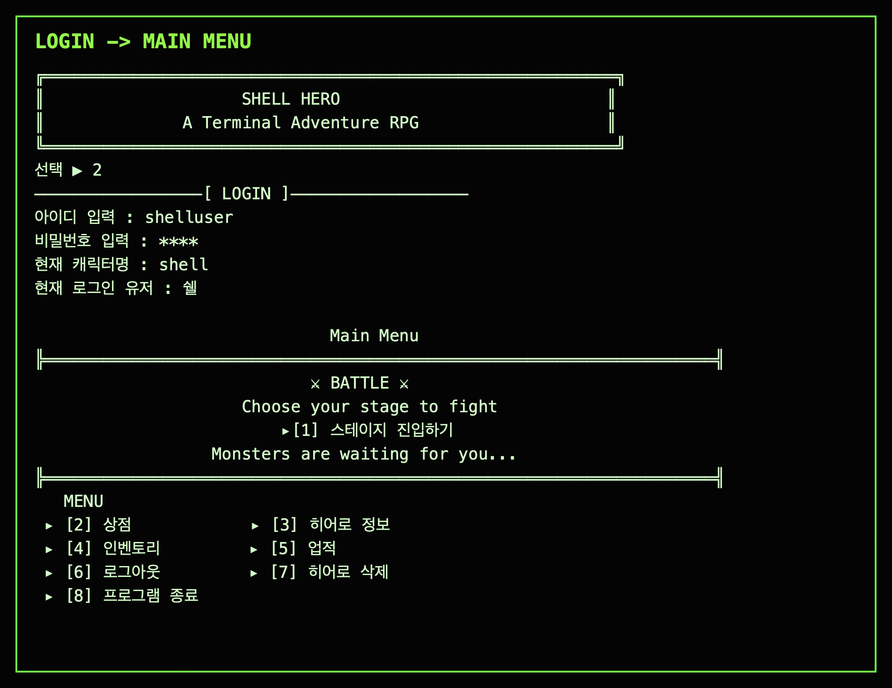
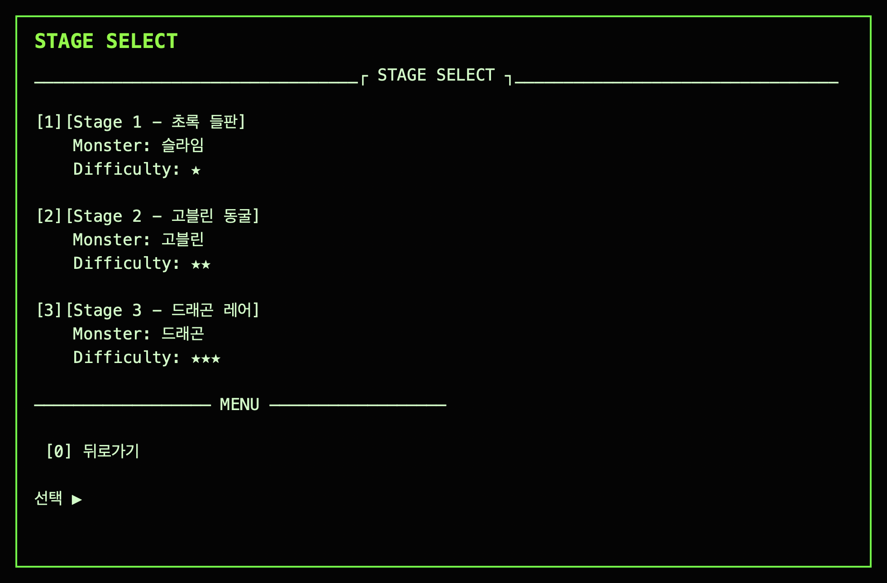
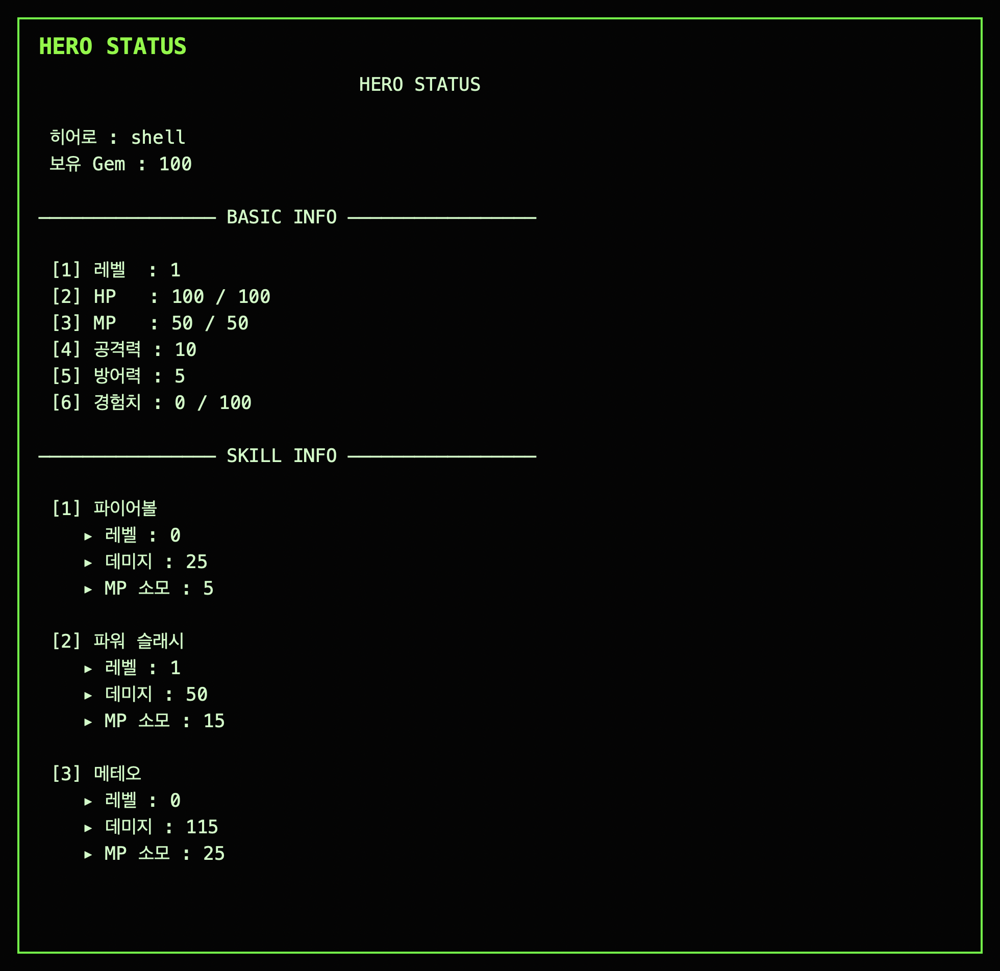

# Shell Hero

> Java 콘솔 환경에서 구현한 로그인 기반 텍스트 턴제 RPG

Shell Hero는 MUD와 텍스트 RPG의 구조를 참고해 만든 콘솔 RPG입니다.
사용자는 계정을 생성하고 히어로를 관리하며, 전투 보상으로 성장한 뒤 상위 스테이지에 도전합니다.


## 🧭 프로젝트 한눈에 보기

| 항목 | 내용 |
|---|---|
| 개발 기간 | 2026.02 ~ 2026.03 |
| 개발 형태 | 4인 팀 프로젝트 |
| 프로젝트 성격 | Java 콘솔 애플리케이션 / JDBC 기반 RPG |
| 핵심 목표 | 계정, 히어로, 전투, 인벤토리, 스킬, 업적 데이터를 관계형 DB로 분리하고 상태 변경 흐름을 안정적으로 연결 |
| 담당 역할 | 팀장, 전투 로직, 회원/로그인, 전체 설계 방향 정리 |
| 검증 상태 | 로컬 MySQL 샘플 DB 기준 로그인, 메인 메뉴, 스테이지 선택, 히어로 정보, 업적 조회 흐름 확인 |

## 🔗 주요 링크

| 구분 | 링크 |
|---|---|
| 발표 자료 | [docs/index.html](./docs/index.html) |
| 중간 발표 | [docs/mid/1.html](./docs/mid/1.html) |
| 최종 발표 | [docs/final/1.html](./docs/final/1.html) |
| 설계 Wiki | [GitHub Wiki](https://github.com/kosta-dev-sjh/p1-4g-java-console/wiki) |

## 💡 왜 만들었나

텍스트 RPG는 화면보다 데이터 변화가 중요한 구조입니다. 전투, 보상, 장비, 스킬, 업적이 모두 히어로 상태를 공유하기 때문에 한 기능의 변경이 다른 기능에 영향을 줄 수 있습니다.

이 프로젝트에서는 게임이라는 익숙한 주제를 사용해 사용자-히어로 분리, 상태 값 정합성, 트랜잭션 처리, DAO 계층 분리 같은 백엔드 기초 설계 문제를 직접 다뤘습니다. 단순히 메뉴가 동작하는 콘솔 게임이 아니라, 여러 도메인 데이터가 연결될 때 어떤 기준으로 책임을 나눌지 학습하는 데 초점을 두었습니다.

## 🖼️ 화면 미리보기

| 화면 | 설명 |
|---|---|
|  | 로그인 후 현재 히어로 세션을 불러오고 메인 메뉴로 진입하는 흐름 |
|  | 스테이지별 몬스터와 난이도를 확인하고 전투 진입을 선택하는 화면 |
|  | 히어로 기본 능력치와 보유 스킬 정보를 조회하는 화면 |

## ✨ 핵심 기능

| 기능 | 설명 | 검증 상태 |
|---|---|---|
| 계정과 히어로 관리 | 회원가입, 로그인, 로그아웃, 사용자당 1명의 히어로 생성 구조를 제공 | 로컬 샘플 DB 기준 로그인 확인 |
| 턴제 전투 | 공격, 방어, 스킬, 아이템 사용, 전투 포기 액션을 제공하고 결과에 따라 보상/패널티를 처리 | 스테이지 선택 진입 확인, 전투 상세 흐름은 코드 기준 확인 |
| 성장과 스킬 | EXP, Level, HP, MP, 공격력, 방어력, GEM 상태를 관리하고 스킬 정보를 조회/강화 | 히어로 정보 화면 확인 |
| 상점과 인벤토리 | 아이템 구매/판매, 장비 장착/해제, 소비 아이템 사용 흐름을 제공 | 코드 및 DAO/Service 흐름 확인 |
| 업적 | 히어로별 퀘스트 진행도와 완료 여부를 저장하고 조회 | 로컬 샘플 DB 기준 업적 조회 확인 |

## 🏗️ 시스템 구조

```text
View
  ↓
Controller
  ↓
Service
  ↓
DAO
  ↓
MySQL
```

콘솔 출력과 사용자 입력은 `View`, 메뉴 흐름은 `Controller`, 비즈니스 규칙은 `Service`, DB 접근은 `DAO`로 분리했습니다. 전투, 보상, 인벤토리처럼 여러 테이블을 함께 변경할 수 있는 기능은 Service 계층에서 흐름을 묶고 DAO가 실제 SQL 실행 책임을 맡도록 구성했습니다.

```text
com.kosta.console_rpg
├─ controller
├─ model
│  ├─ dao
│  ├─ dto
│  ├─ enums
│  └─ service
├─ session
├─ util
└─ view
```

## 🛠️ 기술 스택과 선택 이유

| 영역 | 기술 | 선택 이유 |
|---|---|---|
| Language | Java 21 | 교육 과정에서 학습한 객체지향 문법을 콘솔 애플리케이션 구조로 직접 적용 |
| Database | MySQL | 사용자, 히어로, 아이템, 스킬, 몬스터, 업적 간 관계를 테이블과 FK로 표현하기 적합 |
| Data Access | JDBC, DAO Pattern | SQL 실행 책임을 분리하고 Service 계층의 비즈니스 흐름과 DB 접근을 구분 |
| Architecture | MVC, DTO, Service Layer | 콘솔 출력, 입력 흐름, 상태 변경 로직, 데이터 전달 책임을 나누기 위해 적용 |
| Collaboration | GitHub Wiki, Jira, Slack, PR 리뷰 | 요구사항, ERD, 트러블슈팅, 일정과 리뷰 기준을 팀원 간 공유하기 위해 사용 |

## 🎯 주요 설계 판단

### 사용자와 히어로 데이터 분리

로그인 계정과 게임 진행 상태를 하나로 묶지 않고 `user`와 `hero`를 1:1로 분리했습니다. 인증 정보와 히어로 성장 데이터를 독립적으로 관리하기 위해서입니다.

### enum 기반 전투 상태 관리

전투 행동, 전투 결과, 보상 결과를 문자열로 비교하지 않고 `BattleActionType`, `BattleResult`, `RewardResult` enum으로 구분했습니다. 전투 흐름에서 가능한 상태를 코드상에서 명확히 표현하고, 잘못된 문자열 분기 가능성을 줄이기 위한 선택입니다.

### 트랜잭션 단위 상태 변경

상점 구매, 인벤토리 갱신, 전투 보상처럼 여러 데이터가 동시에 바뀌는 구간은 하나의 흐름으로 처리해야 합니다. 일부 데이터만 반영되는 상황을 줄이기 위해 Service 계층에서 커넥션과 commit/rollback 흐름을 관리했습니다.

## 🗃️ 데이터 모델

| 도메인 | 테이블 | 역할 |
|---|---|---|
| 계정 | `user` | 로그인 ID, 암호화 비밀번호, 사용자명 |
| 히어로 | `hero` | 레벨, 경험치, HP/MP, 공격력, 방어력, GEM, 최고 클리어 스테이지 |
| 아이템 | `item`, `shop`, `inventory` | 아이템 마스터, 상점 목록, 히어로별 보유 아이템 |
| 스킬 | `skill`, `hero_skill` | 스킬 마스터, 히어로별 스킬 레벨 |
| 전투 | `monster` | 스테이지별 몬스터 스탯, 보상, 스킬 사용 확률 |
| 업적 | `quest`, `quest_ing` | 업적 조건, 히어로별 진행도와 완료 여부 |

상세 설계는 [Wiki - Data Dictionary](https://github.com/kosta-dev-sjh/p1-4g-java-console/wiki/08_Data-Dictionary)와 [Wiki - ERD](https://github.com/kosta-dev-sjh/p1-4g-java-console/wiki/09_ERD)에 정리했습니다.

## ✅ 검증한 사용자 흐름

검증 기준일: 2026-06-18
검증 환경: macOS, Java 21, MySQL 샘플 DB, JAR 실행

| 흐름 | 결과 |
|---|---|
| 시작 화면 출력 | ANSI 컬러가 적용된 시작 화면 출력 확인 |
| 로그인 | `shelluser` 샘플 계정으로 로그인 후 현재 히어로 세션 로드 확인 |
| 메인 메뉴 | 로그인 후 전투, 상점, 히어로 정보, 인벤토리, 업적 메뉴 출력 확인 |
| 스테이지 선택 | Stage 1~3 목록과 몬스터/난이도 출력 확인 |
| 히어로 정보 | 히어로 기본 능력치와 3개 스킬 정보 출력 확인 |
| 업적 조회 | 진행 중인 퀘스트와 완료 퀘스트 영역 출력 확인 |

전투 전체 클리어, 스킬 강화, 상점 구매/판매는 코드와 DAO/Service 흐름을 확인했지만, README 교체 시점에는 전체 시나리오를 끝까지 자동 검증하지 않았습니다.

## 🔧 트러블슈팅

| 문제 | 원인/시도 | 해결 | 알게 된 점 |
|---|---|---|---|
| MySQL 테이블 생성 실패 | `character` 테이블명이 MySQL 예약어와 충돌 | 테이블명을 `hero`로 변경하고 관련 DAO/DTO 명명 규칙을 정리 | DB 예약어와 도메인 명칭은 설계 초기에 함께 확인해야 함 |
| 설정 파일 노출 위험 | DB 접속 정보가 `db.properties`에 들어가 Git에 포함될 수 있었음 | 캐시 제거와 문서화를 통해 설정 파일 관리 기준을 정리 | 로컬 실행 설정과 공개 저장소 파일을 분리해야 함 |
| Git 병합/덮어쓰기 문제 | 여러 팀원이 같은 파일과 흐름을 동시에 수정 | PR 기준 머지 규칙과 충돌 복구 절차를 공유 | 협업 규칙은 문제가 생긴 뒤가 아니라 초기에 합의해야 함 |
| 실행 환경 차이 | IDE별 리소스 경로와 JDK 설정 차이로 실행 결과가 달라짐 | classpath 기준 설정 파일 로드와 실행 스크립트 방식을 점검 | 콘솔 프로젝트도 배포/실행 환경을 별도 검증해야 함 |
| 샘플 DB와 화면 기대값 불일치 | 히어로 정보 화면은 3개 스킬을 기대했지만 샘플 데이터에는 2개만 연결되어 있었음 | 샘플 DB에 누락된 히어로 스킬 연결 데이터를 보강 | 화면 코드가 기대하는 마스터 데이터 개수도 검증 대상에 포함해야 함 |

## 👥 팀원 역할

| 이름 | 역할 | 담당 |
|---|---|---|
| 송정현 | 팀장 / 전투 시스템 | 프로젝트 방향 정리, 전투 로직 설계, 회원/로그인, 전체 설계 기준 정리 |
| 홍준화 | 부팀장 / 성장 시스템 | 인벤토리, 상점, 초기 DB 세팅, 샘플 데이터, AWS 환경 설정 |
| 이진주 | 데이터베이스 / UI | Figma UI 설계, 콘솔 View 연출, 스킬 로직, 사용자 입력 흐름 |
| 김재민 | 세션 관리 / 몬스터 | 세션 상태 관리, 몬스터 로직, 게임 스토리, 전투 규칙, 디버깅 |

## 🚀 로컬 실행

JDK 21, MySQL, MySQL JDBC Driver가 필요합니다. DB 접속 정보는 `db.properties`로 분리해 관리하며, 실제 비밀번호는 공개 저장소에 포함하지 않습니다.

```bash
java -Dfile.encoding=UTF-8 \
  -cp "ShellHero.jar:lib/mysql-connector-j-8.4.0.jar" \
  com.kosta.console_rpg.MainApp
```

Windows 환경에서는 `run.bat`을 통해 UTF-8 콘솔과 ANSI 출력 설정을 적용해 실행할 수 있습니다.

## 🧩 회고

### 잘한 점

- 구현 전에 요구사항, 데이터 흐름, 클래스 책임, 기능 경계를 먼저 정리해 팀원들이 같은 기준으로 개발할 수 있도록 조율했습니다.
- 전투와 보상처럼 여러 상태가 함께 바뀌는 흐름을 단일 기능으로 보지 않고, DB 정합성 관점에서 나누어 설계했습니다.
- GitHub Wiki에 요구사항, ERD, 클래스 구조, 트러블슈팅을 남겨 발표 이후에도 설계 근거를 확인할 수 있게 했습니다.

### 아쉬운 점

- 자동 테스트가 없어 로그인, 전투, 상점, 인벤토리 흐름을 수동으로 검증해야 했습니다.
- 샘플 데이터와 화면 기대값이 어긋나는 문제가 뒤늦게 발견되어, 마스터 데이터 검증 절차가 필요하다는 점을 확인했습니다.

### 다음 개선

- Spring Boot 기반 웹 API로 확장해 콘솔 UI와 비즈니스 로직을 분리
- 테스트 코드와 샘플 DB 검증 스크립트를 추가해 실행 전 데이터 누락을 확인
- BGM과 효과음을 추가해 콘솔 게임의 몰입감 강화
- 아이템, 스킬, 몬스터 마스터 데이터를 관리할 수 있는 관리자 도구 구현
